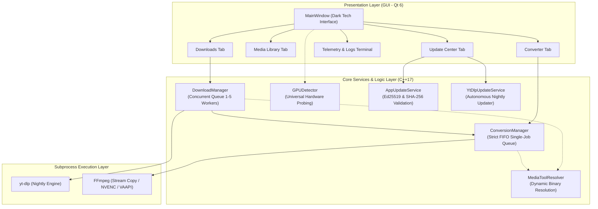
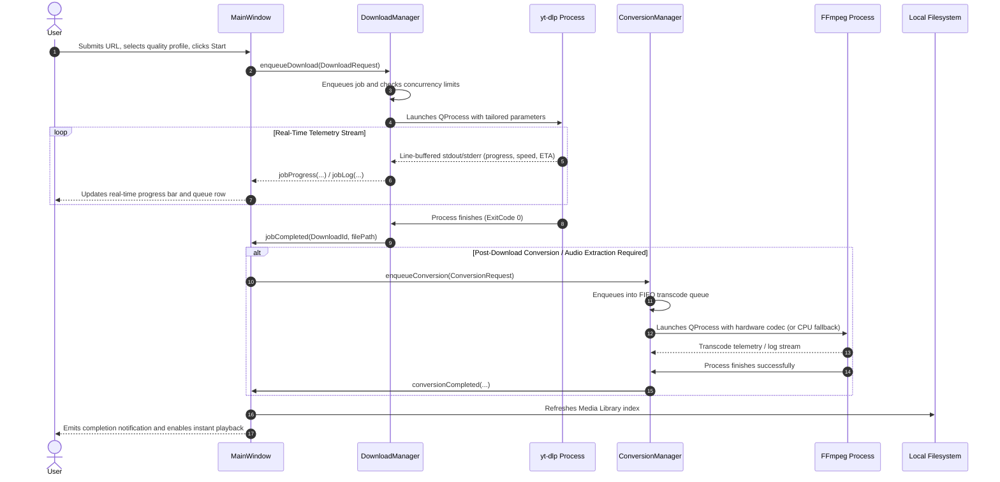
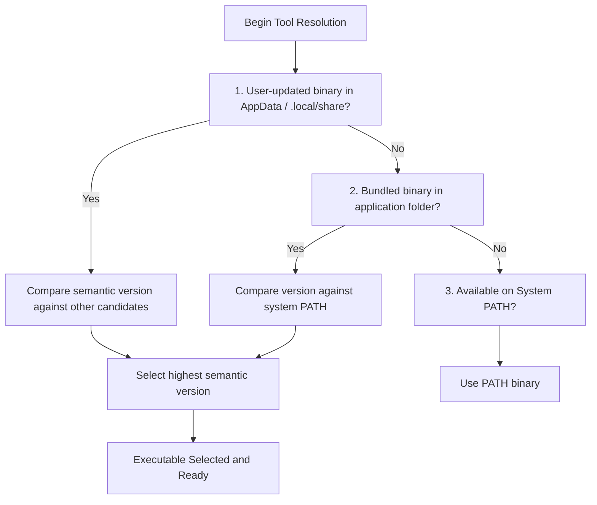

# 🏗️ System Architecture & Concurrency — Prism Downloader

  <a href="pt/ARQUITETURA.md">🇧🇷 Leia a versão em Português do Brasil (PT-BR) aqui.</a>

This document provides a comprehensive technical overview of the software architecture, data flow pipeline, process management, and concurrency models in **Prism Downloader**, engineered with **Pure C++17** and **Qt 6**.

---

## 📐 1. Architectural Overview

Prism Downloader follows an asynchronous, decoupled architectural pattern powered by the **Qt Signal and Slot mechanism** and **isolated child process execution (`QProcess`)**. Heavy network operations (`yt-dlp` stream extraction) and intensive multimedia processing (`FFmpeg` muxing and hardware transcode) run in asynchronous subprocesses, keeping the graphical user interface thread (UI Thread) completely responsive at all times.

---

## 🔄 2. End-to-End Data Flow

The lifecycle of a media task progresses through well-defined, deterministic states:

---

## ⚙️ 3. Concurrency & Queue Management

### 3.1. Concurrent Download Queue (`DownloadManager`)
* **Dynamic Concurrency Control:** Users can adjust active download workers between **1 and 5 parallel tasks** on the fly via the UI (`m_concurrencySpin`).
* **Reactive Scheduler (`schedule()`):** When a job finishes, fails, is cancelled, or when concurrency limits are increased, the scheduler automatically pulls and activates the next pending job from `m_pending`.
* **Telemetry Line Parsing:** Asynchronous stdout and stderr buffers from `yt-dlp` are parsed in chunks using regular expressions and token extractors to capture:
  - Completion percentage (`%`).
  - Transfer speed (e.g., `14.2MiB/s`).
  - Estimated time of arrival (ETA).
  - Target destination file paths (`[Merger] Merging formats into "..."` or `[download] Destination: ...`).

### 3.2. Sequential Transcode Queue (`ConversionManager`)
* **Strict Single-Job FIFO Execution:** In contrast to network downloads, video and audio transcoding operations place heavy demands on physical hardware (VRAM allocation, hardware encoder channels on NVENC/AMF/QSV, and CPU core utilization).
* To protect the operating system against GPU driver crashes or 100% CPU saturation, `ConversionManager` executes exactly **one active conversion process at a time** (`m_active`), holding subsequent requests in an ordered queue (`m_pending`).

---

## 🛡️ 4. Process Lifecycle & Session Isolation

### 4.1. Zombie and Orphan Process Prevention
* Prism Downloader invokes subprocesses using `QProcess::start(program, arguments)` with structured argument lists, eliminating command-line shell injection risks and avoiding command prompt window flashes.
* On **Windows**, processes are tracked and cleanly terminated using Win32 process handles.
* On **Linux**, each download job spawns in its own process session (`setsid`). If `yt-dlp` launches child `ffmpeg` processes for post-processing, cancelling the task kills the entire process group, leaving zero background orphans.

### 4.2. Safe Application Shutdown (`closeEvent`)
* When closing the main window (`MainWindow::closeEvent`), the application performs a graceful teardown:
  1. Cancels all active and pending downloads (`m_downloadManager->cancelAll()`).
  2. Cancels all scheduled automatic conversions (`m_conversionManager->cancelAllAutomatic()`).
  3. Disconnects network listeners from update services.
  4. Releases file descriptors before exiting the Qt event loop.

---

## 🧩 5. Dynamic Binary Resolution Strategy (`MediaToolResolver`)

The application searches for `yt-dlp` and `FFmpeg` executables across several locations:

This multi-tiered resolution guarantees that:
1. End users can run the app out of the box without configuring environment variables.
2. Self-updating `yt-dlp` Nightly builds take precedence over outdated bundled binaries.
3. Newer system-wide tools installed by power users on `PATH` can be preferred automatically.
