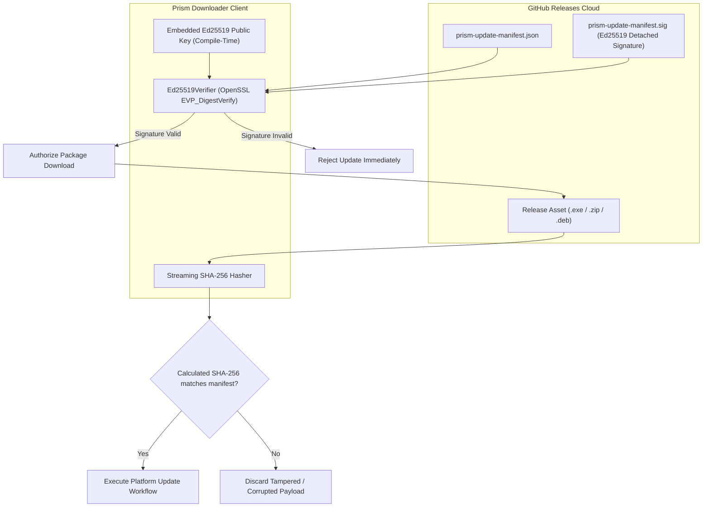

# 🛡️ Secure Auto-Update & Cryptography — Prism Downloader

<p align="center">
  <a href="pt/AUTO_UPDATE.md">🇧🇷 Leia a versão em Português do Brasil (PT-BR) aqui.</a>
</p>

This document details the automatic update architecture of **Prism Downloader** and the **yt-dlp engine**, featuring cryptographic verification based on **Ed25519 digital signatures** and **streaming SHA-256 checksums**.

---

## 🔒 1. Cryptographic Security Model

To protect users against Man-in-the-Middle (MitM) attacks, tampered release packages, or compromised distribution mirrors, Prism Downloader enforces a **Zero-Trust Security Model**:

> [!IMPORTANT]
> **No update package is executed or installed** unless the release manifest carries a valid detached **Ed25519** signature verified against the embedded public key, and the downloaded package payload matches the **SHA-256** hash declared in the signed manifest.



---

## 📄 2. Update Manifest Specification

Each official release publishes two companion metadata assets:
1. `prism-update-manifest.json`: JSON file listing release version and SHA-256 hashes for all supported distribution packages.
2. `prism-update-manifest.sig`: Binary signature file created with the author's private Ed25519 key.

### Manifest Format Example (`prism-update-manifest.json`):
```json
{
  "version": "2.1.0",
  "packages": {
    "windows_setup": {
      "asset_name": "PrismDownloader_v2.1.0_Setup.exe",
      "sha256": "e3b0c44298fc1c149afbf4c8996fb92427ae41e4649b934ca495991b7852b855"
    },
    "windows_portable": {
      "asset_name": "PrismDownloader_v2.1.0_Portable.zip",
      "sha256": "ca978112ca1bbdcafac231b39a23dc4da786eff8147c4e72b9807785afee48bb"
    },
    "linux_deb": {
      "asset_name": "prism-downloader_2.1.0_amd64.deb",
      "sha256": "5891b5b522d5df086d0ff0b110fbd9d21bb4fc7163af34d08286a2e846f6be03"
    }
  }
}
```

---

## 🚀 3. Platform-Specific Update Workflows

Prism Downloader inspects its runtime environment and executes the appropriate installation strategy:

### 3.1. Windows Installed Copy (Inno Setup)
* `AppUpdateService` downloads and verifies `PrismDownloader_vX.Y.Z_Setup.exe`.
* Launches the installer wizard or silent updater to replace application files and relaunch.

### 3.2. Windows Portable Copy (`PortableUpdateHelper`)
Portable installations cannot overwrite files while the main executable is loaded into memory:
1. Downloads and validates `PrismDownloader_vX.Y.Z_Portable.zip`.
2. Spawns the detached helper process:
   ```cmd
   portable-update-helper.exe --parent-pid <PID> --archive <ZIP_FILE> --target <APP_DIR>
   ```
3. The main application closes gracefully.
4. `portable-update-helper.exe` waits for PID release, extracts the ZIP to a staging directory (`.prism-update-staging-XXXXXX`), takes an atomic backup of the previous directory (`.prism-update-backup-<PID>`), and swaps the directories.
5. If any extraction error occurs, the helper rolls back from the backup immediately.
6. Launches the updated `PrismDownloader.exe` via `QProcess::startDetached` and deletes temporary staging files.

### 3.3. Linux (`.deb` Package)
* Downloads and validates `prism-downloader_X.Y.Z_amd64.deb`.
* Prompts the user and triggers `pkexec apt install ./prism-downloader_X.Y.Z_amd64.deb` or opens the default desktop package manager.

---

## 🎵 4. Independent `yt-dlp` Engine Updates

Online video platforms modify streaming protocols frequently. To prevent download disruptions between app releases, the `yt-dlp` engine updates independently:

* **Official Nightly Channel:** `YtDlpUpdateService` queries the official `yt-dlp` Nightly release channel on GitHub.
* **Checksum Verification:** Downloads `SHA2-256SUMS` and validates the target binary (`yt-dlp.exe` on Windows or `yt-dlp_linux` on Linux).
* **Zero-Privilege User Installation:** Installs into user local data storage:
  - Windows: `%LOCALAPPDATA%\PrismDownloader\yt-dlp.exe`
  - Linux: `~/.local/share/prism-downloader/yt-dlp`
* `MediaToolResolver` dynamically discovers and routes all subsequent download tasks to the updated binary.

---

## 🔑 5. Maintainer Scripts & Key Management

Two utility scripts in `scripts/` support the release signing pipeline:

### 5.1. `generate-update-signing-key.ps1`
Generates an Ed25519 private/public keypair in temporary memory and uploads the private key directly to GitHub Secrets (`PRISM_UPDATE_ED25519_PRIVATE_KEY`):
```powershell
.\scripts\generate-update-signing-key.ps1 -Repository BadTonho/PrismDownloader
```

### 5.2. `create_update_manifest.py`
Computes SHA-256 hashes of release artifacts and creates `prism-update-manifest.json` for signing during CI:
```bash
python scripts/create_update_manifest.py --version 2.1.0 --dist-dir ./dist --output prism-update-manifest.json
```
