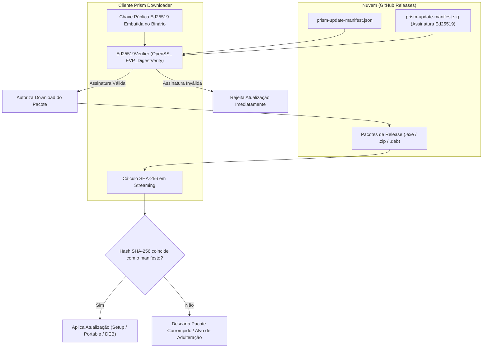

# 🛡️ Sistema de Atualização Segura — Prism Downloader

Este documento descreve em detalhes a arquitetura de atualização automática do **Prism Downloader** e do motor **yt-dlp**, com validação criptográfica de integridade e autenticidade baseada em **Ed25519** e **SHA-256**.

---

## 🔒 1. Princípios de Segurança Criptográfica

Para proteger os usuários contra ataques do tipo *Man-in-the-Middle* (MitM), adulteração de pacotes e publicações comprometidas, o Prism Downloader adota um modelo de **confiança zero (Zero-Trust)**:

> [!IMPORTANT]
> **Nenhuma atualização de aplicativo é instalada** a menos que o manifesto de release contenha uma assinatura digital destacada válida (**Ed25519**) e que o pacote baixado tenha seu hash **SHA-256** exatamente idêntico ao declarado no manifesto assinado.



---

## 📄 2. Estrutura do Manifesto de Atualização

Cada release oficial publica dois arquivos auxiliares:
1. `prism-update-manifest.json`: JSON com a versão e os hashes SHA-256 de todas as 3 variantes de distribuição.
2. `prism-update-manifest.sig`: Arquivo binário contendo a assinatura digital gerada com a chave privada Ed25519 do autor.

### Exemplo de `prism-update-manifest.json`:
```json
{
  "version": "2.1.0",
  "packages": {
    "windows_setup": {
      "asset_name": "PrismDownloader_v2.1.0_Setup.exe",
      "sha256": "e3b0c44298fc1c149afbf4c8996fb92427ae41e4649b934ca495991b7852b855"
    },
    "windows_portable": {
      "asset_name": "PrismDownloader_v2.1.0_Portable.zip",
      "sha256": "ca978112ca1bbdcafac231b39a23dc4da786eff8147c4e72b9807785afee48bb"
    },
    "linux_deb": {
      "asset_name": "prism-downloader_2.1.0_amd64.deb",
      "sha256": "5891b5b522d5df086d0ff0b110fbd9d21bb4fc7163af34d08286a2e846f6be03"
    }
  }
}
```

---

## 🚀 3. Fluxo de Atualização por Tipo de Pacote

O Prism Downloader detecta automaticamente como foi instalado e seleciona a estratégia de atualização apropriada:

### 3.1. Windows Instalado (Inno Setup)
* O `AppUpdateService` baixa o instalador oficial `PrismDownloader_vX.Y.Z_Setup.exe`.
* Após a validação criptográfica, executa o instalador para atualizar a pasta em `Program Files` e reiniciar a aplicação.

### 3.2. Windows Portátil (Portable ZIP & `PortableUpdateHelper`)
A atualização de um aplicativo portátil não pode sobrescrever arquivos enquanto o executável principal estiver aberto em memória. Para solucionar isso:
1. O Prism baixa e valida o arquivo `PrismDownloader_vX.Y.Z_Portable.zip`.
2. O Prism dispara o executável auxiliar em background:
   ```cmd
   portable-update-helper.exe --parent-pid <PID> --archive <ARQUIVO_ZIP> --target <PASTA_DO_APP>
   ```
3. O Prism principal é fechado.
4. O `portable-update-helper.exe` aguarda a liberação dos arquivos, descompacta a nova versão em uma pasta de staging (`.prism-update-staging-XXXXXX`), cria um backup atômico da pasta antiga e efetua a substituição.
5. Se ocorrer qualquer falha durante a extração, o assistente reverte o backup automaticamente.
6. O novo `PrismDownloader.exe` é iniciado e o helper limpa os temporários.

### 3.3. Linux (Pacote Debian `.deb`)
* O aplicativo baixa e valida o pacote `prism-downloader_X.Y.Z_amd64.deb`.
* O Prism notifica o usuário e aciona a instalação via `pkexec apt install ./prism-downloader_X.Y.Z_amd64.deb` ou ferramenta gráfica padrão (`gdebi` / Central de Aplicativos).

---

## 🎵 4. Atualização Autônoma do Motor `yt-dlp`

O ecossistema de vídeos na web altera seus protocolos com frequência. Para garantir que o Prism Downloader nunca pare de funcionar por desatualização de API externa, o motor `yt-dlp` possui um ciclo de vida de atualização independente:

* **Canal Nightly Oficial:** O serviço `YtDlpUpdateService` consulta o repositório oficial do `yt-dlp` no GitHub.
* **Validação de Checksum:** Baixa a tabela oficial de hashes `SHA2-256SUMS` e confere a integridade do executável binário (`yt-dlp.exe` no Windows ou `yt-dlp_linux` no Linux).
* **Instalação Sem Privilégios de Administrador:** A versão atualizada é gravada no diretório de dados do usuário:
  - Windows: `%LOCALAPPDATA%\PrismDownloader\yt-dlp.exe`
  - Linux: `~/.local/share/prism-downloader/yt-dlp`
* O `MediaToolResolver` detecta a presença da nova versão e a utiliza imediatamente para todos os novos downloads.

---

## 🔑 5. Scripts de Manutenção e Geração de Chaves

Os mantenedores do projeto contam com dois scripts utilitários na pasta `scripts/`:

### 5.1. `generate-update-signing-key.ps1`
Gera um par de chaves assimétricas Ed25519 de forma segura em ambiente temporário e configura a chave privada diretamente nos GitHub Secrets do repositório (`PRISM_UPDATE_ED25519_PRIVATE_KEY`):
```powershell
.\scripts\generate-update-signing-key.ps1 -Repository BadTonho/PrismDownloader
```

### 5.2. `create_update_manifest.py`
Calcula os hashes SHA-256 de todos os artefatos de release e gera o arquivo `prism-update-manifest.json` para ser assinado no pipeline de CI/CD:
```bash
python scripts/create_update_manifest.py --version 2.1.0 --dist-dir ./dist --output prism-update-manifest.json
```
