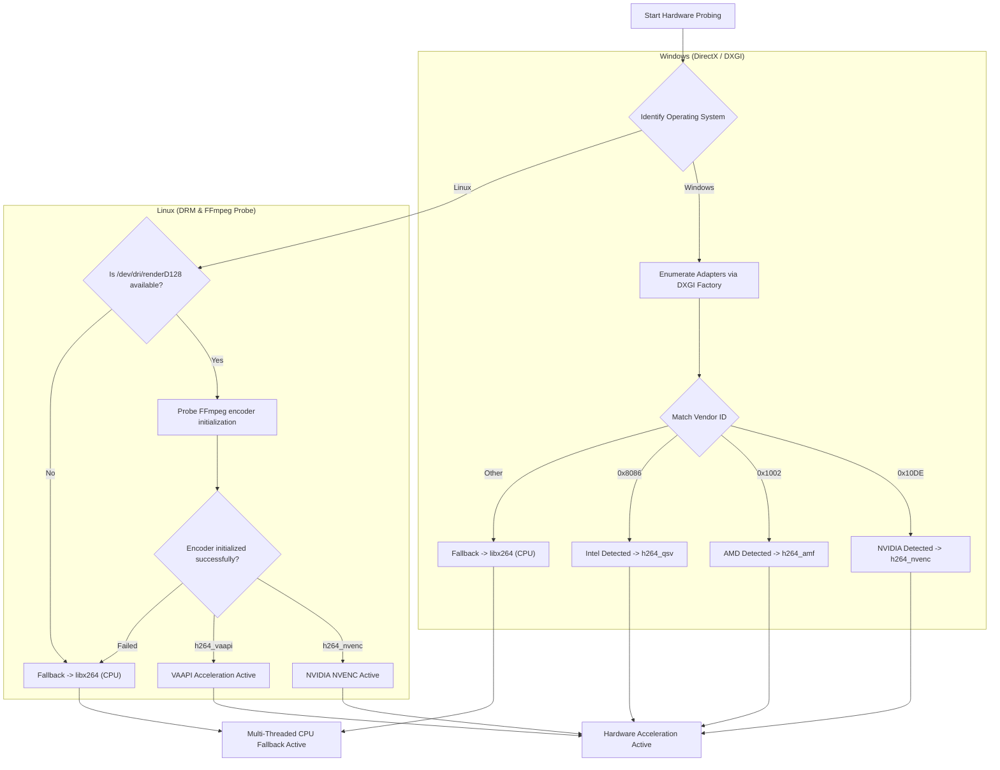

# ⚡ Hardware & GPU Acceleration — Prism Downloader

<p align="center">
  <a href="pt/HARDWARE_GPU.md">🇧🇷 Leia a versão em Português do Brasil (PT-BR) aqui.</a>
</p>

This guide details how **Prism Downloader** detects and leverages dedicated and integrated graphics processing units (GPUs) to maximize conversion speeds while preserving system responsiveness and minimizing CPU load.

---

## 🎯 1. Performance Philosophy: Stream Copy vs. Transcoding

Prism Downloader minimizes system resource consumption by selecting the fastest possible execution path:

### 1.1. Lossless Muxing (*Stream Copy*) — Default Download Flow
* When downloading media streams provided directly by online platforms (e.g., 1080p MP4 video stream + M4A audio stream), Prism **does not re-encode video frames**.
* `FFmpeg` merges the separate tracks via direct stream copying (`-c copy`), completing in **1 to 2 seconds** with **0% GPU/CPU overhead** and **100% original quality**.

### 1.2. GPU-Accelerated Transcoding — When Necessary
* Hardware acceleration activates whenever media data genuinely requires re-encoding:
  - Custom file format conversions in the Converter tab (e.g., MKV to MP4, WebM to MP4).
  - High-compression transcoding and custom bitrate adjustments.
  - Complex trimming with frame-accurate video re-encoding.

---

## 📊 2. Codec & Vendor Compatibility Matrix

| Vendor / Architecture | Platform | H.264 Codec | HEVC (H.265) Codec | Acceleration Technology |
| :--- | :--- | :--- | :--- | :--- |
| **NVIDIA GeForce / RTX / Quadro** | Windows / Linux | `h264_nvenc` | `hevc_nvenc` | **NVIDIA NVENC SDK** on dedicated silicon. |
| **AMD Radeon (RX / Ryzen APU)** | Windows | `h264_amf` | `hevc_amf` | **AMD Advanced Media Framework (AMF)**. |
| **AMD Radeon (Linux)** | Linux | `h264_vaapi` | `hevc_vaapi` | **VAAPI** via DRM render node (`/dev/dri/renderD128`). |
| **Intel Arc / Iris Xe / HD Graphics** | Windows | `h264_qsv` | `hevc_qsv` | **Intel Quick Sync Video (QSV)**. |
| **Intel Graphics (Linux)** | Linux | `h264_vaapi` | `hevc_vaapi` | **VAAPI** via Intel Media Driver / iHD. |
| **CPU Multi-Thread Fallback** | All | `libx264` | `libx265` | Multi-threaded software encoding. |

---

## 🔍 3. Hardware Probing Architecture (`GPUDetector`)

The `GPUDetector` class provides native, non-blocking hardware inspection tailored to each host operating system:



### 3.1. Windows Probing
* Leverages the native **DXGI (`IDXGIFactory` / `IDXGIAdapter`)** subsystem without third-party wrapper dependencies.
* Inspects adapter description (e.g., `"NVIDIA GeForce GTX 1660 SUPER"`) and dedicated video memory (VRAM).
* Maps Vendor IDs to optimal FFmpeg encoder arguments.

### 3.2. Linux Probing
* Checks device existence and read/write permissions on the Direct Rendering Manager device node (`/dev/dri/renderD128`).
* Performs a dry-run encoder test with `ffmpeg` to verify that kernel drivers and user-space libraries (`mesa-va-drivers`, `intel-media-va-driver`, `nvidia-driver`) instantiate encoding contexts properly.
* Automatically falls back to multi-threaded CPU encoding if driver permissions or packages are missing.

---

## 💻 4. Command-Line Hardware Diagnostics (`--diagnose-gpu`)

To inspect hardware acceleration status from terminal sessions or headless systems:

### On Windows:
```cmd
PrismDownloader.exe --diagnose-gpu
```

### On Linux:
```bash
prism-downloader --diagnose-gpu
```

### Sample Output:
```text
[PRISM HARDWARE TELEMETRY]
--------------------------------------------------
Detected Graphics Card   : NVIDIA GeForce GTX 1660 SUPER
Hardware Acceleration    : ENABLED (NVIDIA NVENC)
Primary Video Codec      : h264_nvenc
Primary HEVC / 4K Codec  : hevc_nvenc
DRM / Render Device Node : Direct3D11 / NVENC Hardware Engine
Diagnostic Status        : Dedicated silicon acceleration validated and ready.
--------------------------------------------------
```

---

## 💡 5. Linux Permissions & Driver Optimization

If an AMD or Intel GPU on Linux is flagged as `CPU Multi-Thread Fallback`, verify DRM device permissions:

```bash
# Add current user to render and video groups
sudo usermod -aG render,video $USER

# Install recommended VAAPI packages (Ubuntu/Mint)
sudo apt install mesa-va-drivers intel-media-va-driver vainfo

# Verify VAAPI driver functionality
vainfo
```
Log out and back in after updating group memberships for permissions to apply.
