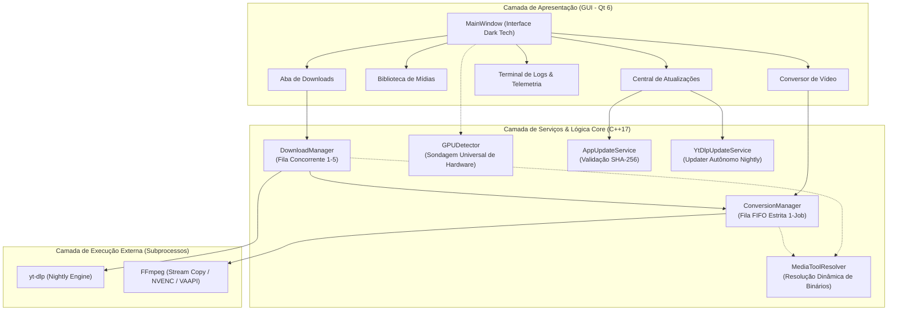
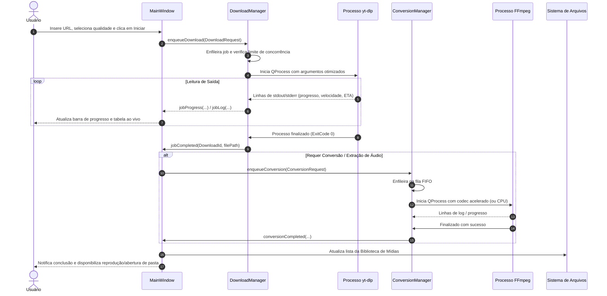
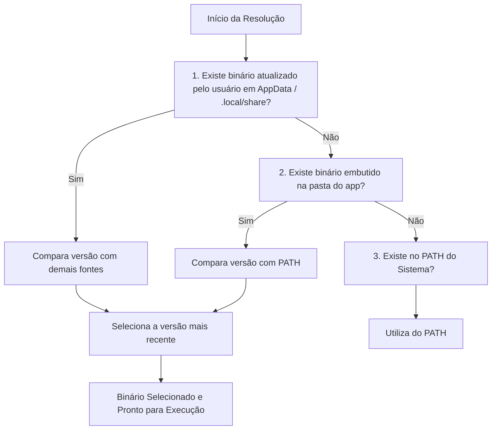

# 🏗️ Arquitetura do Sistema — Prism Downloader

  <a href="../ARCHITECTURE.md">🇺🇸 Read the English version here.</a>

Este documento detalha a arquitetura de software, fluxo de dados e o modelo de concorrência do **Prism Downloader**, projetado em **C++17** com **Qt 6** para máxima velocidade de execução, responsividade de interface e estabilidade operacional.

---

## 📐 1. Visão Geral da Arquitetura

O Prism Downloader adota um padrão arquitetural desacoplado, baseado no modelo reativo de **Sinais e Slots do Qt** e no **isolamento de processos externos (`QProcess`)**. Essa separação garante que o processamento pesado de rede (download de fluxos com `yt-dlp`) e de multimídia (muxing e transcodificação com `FFmpeg`) ocorra em processos filhos assíncronos, sem bloquear a thread principal da interface gráfica (UI Thread).

---

## 🔄 2. Fluxo de Dados Ponta a Ponta

O ciclo de vida de uma operação de download e processamento segue um fluxo estruturado com estados determinísticos:

---

## ⚙️ 3. Modelo de Concorrência e Gestão de Filas

### 3.1. Fila de Downloads (`DownloadManager`)
* **Concorrência Configurável:** O usuário pode definir dinamicamente entre **1 e 5 downloads simultâneos** através da UI (`m_concurrencySpin`).
* **Agendador Reativo (`schedule()`):** Sempre que uma tarefa é finalizada, cancelada ou quando o limite de concorrência é aumentado, o agendador ativa a próxima tarefa pendente da fila (`m_pending`).
* **Parser de Telemetria:** A saída padrão do `yt-dlp` é lida linha a linha através de buffers de texto (`readProcessOutput()`), extraindo com expressões regulares:
  - Percentual concluído (`%`).
  - Velocidade de transferência (ex: `14.2MiB/s`).
  - Tempo estimado de conclusão (ETA).
  - Destino final do arquivo (`[Merger] Merging formats into "..."` ou `[download] Destination: ...`).

### 3.2. Fila de Conversão FIFO (`ConversionManager`)
* **Execução Sequencial Estrita (Single-Job):** Ao contrário dos downloads de rede, transcodificações de áudio e vídeo competem intensamente por recursos de hardware (memória VRAM, canais de encoder NVENC/AMF/QSV ou threads de CPU).
* Para evitar travamento do driver de vídeo ou saturação de 100% dos núcleos do processador, o `ConversionManager` processa rigorosamente **uma conversão por vez** (`m_active`), mantendo as demais em espera ordenada (`m_pending`).

---

## 🛡️ 4. Gerenciamento de Processos e Isolamento de Sessão

### 4.1. Prevenção de Processos Zumbis
* O Prism Downloader utiliza `QProcess::start(program, arguments)` com passagem direta de argumentos estruturados (evitando injeção de shell e necessidade de abrir janelas `cmd.exe` ou `sh`).
* No **Windows**, subprocessos são vinculados e monitorados pelo identificador de processo (`Q_PID`).
* No **Linux**, cada download cria uma nova sessão de processo (`setsid`), garantindo que se o `yt-dlp` disparar instâncias filhas de `ffmpeg` para pós-processamento, o encerramento ou cancelamento da tarefa elimine toda a árvore de processos sem deixar órfãos em background.

### 4.2. Encerramento Seguro da Aplicação (`closeEvent`)
* Ao fechar a janela principal (`MainWindow::closeEvent`), o aplicativo realiza uma finalização graciosa:
  1. Cancela todos os downloads pendentes e em execução (`m_downloadManager->cancelAll()`).
  2. Cancela a fila de conversões automáticas (`m_conversionManager->cancelAllAutomatic()`).
  3. Desconecta sinais de rede do sistema de atualização.
  4. Aguarda a liberação dos descritores de arquivo antes de sair do loop de eventos.

---

## 🧩 5. Resolução Dinâmica de Ferramentas (`MediaToolResolver`)

O Prism Downloader implementa uma estratégia multicamadas para encontrar os binários do `yt-dlp` e `FFmpeg`:

Essa lógica assegura que:
1. O usuário final que nunca configurou variáveis de ambiente possa usar o app imediatamente (graças aos binários bundled).
2. Atualizações do `yt-dlp` possam ser instaladas pelo próprio aplicativo em tempo real.
3. Se o usuário tiver uma versão global mais recente instalada no sistema operacional, ela seja aproveitada automaticamente.
