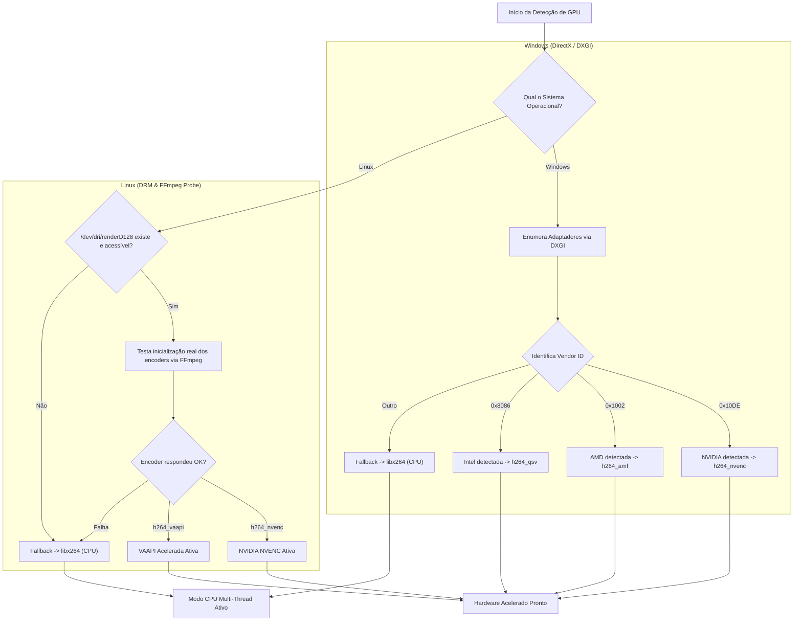

# ⚡ Aceleração por Hardware & GPU — Prism Downloader

<p align="center">
  <a href="../HARDWARE_GPU.md">🇺🇸 Read the English version here.</a>
</p>

Este documento explica como o **Prism Downloader** detecta e utiliza placas de vídeo dedicadas e integradas para acelerar a conversão de mídias, preservando o desempenho do sistema e reduzindo drasticamente o consumo de CPU.

---

## 🎯 1. Filosofia de Desempenho: Stream Copy vs. Transcodificação

O Prism Downloader prioriza sempre a menor sobrecarga de processamento possível:

### 1.1. Muxing Sem Perda (*Stream Copy*) — Padrão de Download
* Quando o usuário baixa um vídeo nos formatos originais disponibilizados pelas plataformas (ex: faixa de vídeo 1080p MP4 + faixa de áudio M4A), o Prism **não recodifica os frames**.
* O `FFmpeg` realiza a união (*muxing*) direta dos fluxos com cópia de stream (`-c copy`), finalizando o arquivo em **1 a 2 segundos**, com **0% de uso de GPU/CPU** e **100% de fidelidade visual**.

### 1.2. Transcodificação Acelerada por GPU — Quando Necessária
* A aceleração de hardware entra em ação quando há necessidade real de reprocessar os dados:
  - Conversão manual de formatos de vídeo na aba Conversor (ex: MKV para MP4, WebM para MP4).
  - Extração e compressão personalizada.
  - Recortes complexos com re-encode de vídeo.

---

## 📊 2. Matriz de Codecs e Suporte por Fabricante

| Fabricante / Arquitetura | Plataforma | Codec H.264 | Codec HEVC (H.265) | Tecnologia de Aceleração |
| :--- | :--- | :--- | :--- | :--- |
| **NVIDIA GeForce / RTX / Quadro** | Windows / Linux | `h264_nvenc` | `hevc_nvenc` | **NVIDIA NVENC SDK** dedicado no chip da GPU. |
| **AMD Radeon (RX / APU Ryzen)** | Windows | `h264_amf` | `hevc_amf` | **AMD Advanced Media Framework (AMF)**. |
| **AMD Radeon (Linux)** | Linux | `h264_vaapi` | `hevc_vaapi` | **VAAPI** via dispositivo DRM (`/dev/dri/renderD128`). |
| **Intel Arc / Iris Xe / HD Graphics** | Windows | `h264_qsv` | `hevc_qsv` | **Intel Quick Sync Video (QSV)**. |
| **Intel Graphics (Linux)** | Linux | `h264_vaapi` | `hevc_vaapi` | **VAAPI** via driver Intel Media / iHD. |
| **CPU Fallback (Universal)** | Qualquer | `libx264` | `libx265` | Processamento multithread otimizado em software. |

---

## 🔍 3. Como Funciona a Sondagem de Hardware (`GPUDetector`)

A classe `GPUDetector` implementa algoritmos de sondagem nativos e não-bloqueantes adaptados para cada sistema operacional:



### 3.1. Sondagem no Windows
* Utiliza a API nativa **DXGI (`IDXGIFactory` / `IDXGIAdapter`)** para inspecionar os adaptadores gráficos instalados sem necessitar de bibliotecas de terceiros pesadas.
* Extrai a descrição oficial do dispositivo (ex: `"NVIDIA GeForce GTX 1660 SUPER"`) e a quantidade de memória de vídeo dedicada (VRAM).
* Mapeia automaticamente o Vendor ID correspondente e configura o codec ótimo no FFmpeg.

### 3.2. Sondagem no Linux
* Verifica a existência e permissões de leitura/escrita no nó de renderização do Direct Rendering Manager (`/dev/dri/renderD128` ou `/dev/dri/card0`).
* Executa uma micro-sondagem com o binário `ffmpeg` para testar se os módulos de kernel e drivers de usuário (ex: `nvidia-driver`, `mesa-va-drivers`, `intel-media-va-driver`) realmente conseguem instanciar um contexto de codificação de hardware.
* Se os drivers não responderem ou faltar permissão de usuário no grupo `render`, a aplicação não trava: ativa silenciosamente o fallback em CPU multithreaded (`libx264`).

---

## 💻 4. Diagnóstico de Hardware via Linha de Comando (`--diagnose-gpu`)

Para verificar a compatibilidade de hardware em servidores, máquinas sem interface gráfica imediata ou para depuração rápida, o executável do Prism disponibiliza o sinalizador `--diagnose-gpu`:

### No Windows:
```cmd
PrismDownloader.exe --diagnose-gpu
```

### No Linux:
```bash
prism-downloader --diagnose-gpu
```

### Exemplo de Saída do Diagnóstico:
```text
[PRISM HARDWARE TELEMETRY]
--------------------------------------------------
Placa de Vídeo Detectada : NVIDIA GeForce GTX 1660 SUPER
Aceleração por Hardware  : ATIVADA (NVIDIA NVENC)
Codec de Vídeo Primário  : h264_nvenc
Codec HEVC / 4K Primário : hevc_nvenc
Dispositivo DRM / Render : Direct3D11 / NVENC Hardware Engine
Diagnóstico              : Aceleração nativa por chip dedicado pronta para uso.
--------------------------------------------------
```

---

## 💡 5. Dicas de Otimização e Permissões no Linux

Se a sua GPU AMD ou Intel no Linux for detectada como `CPU Multi-Thread Fallback`, verifique se o seu usuário possui permissão para acessar os dispositivos DRM:

```bash
# Adicionar o usuário atual aos grupos de renderização e vídeo
sudo usermod -aG render,video $USER

# Instalar drivers VAAPI recomendados (Ubuntu/Mint)
sudo apt install mesa-va-drivers intel-media-va-driver vainfo

# Validar suporte VAAPI no terminal
vainfo
```
Reinicie a sessão do usuário após adicionar aos grupos para que as permissões entrem em vigor.
